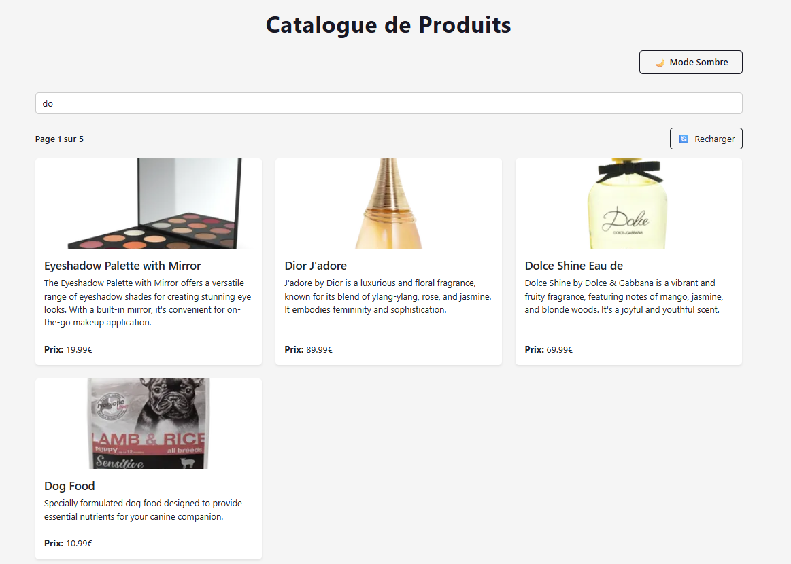
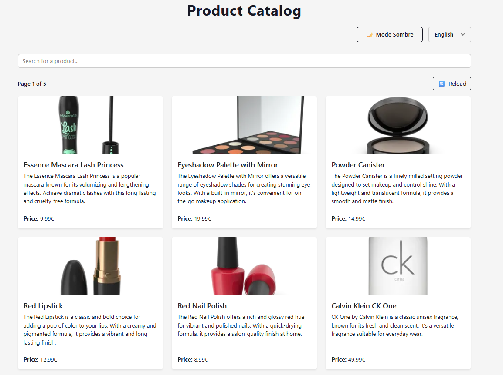
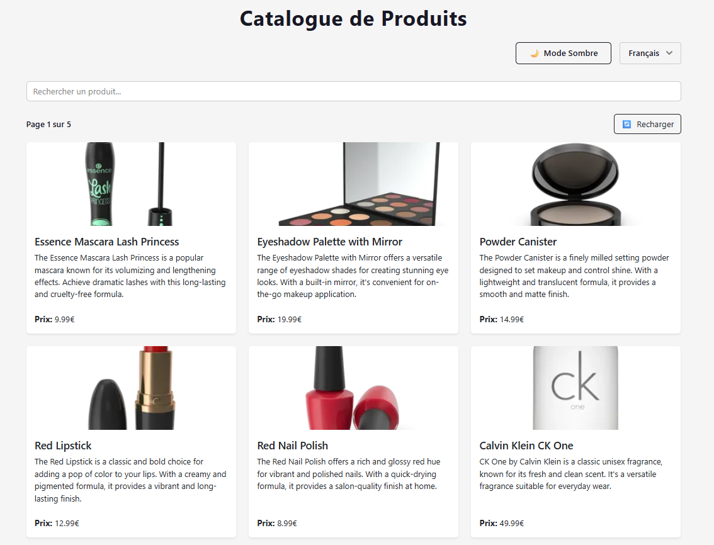
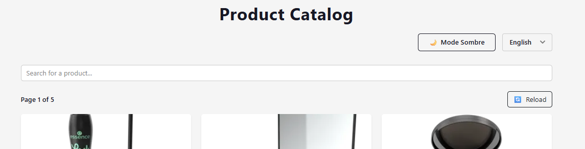
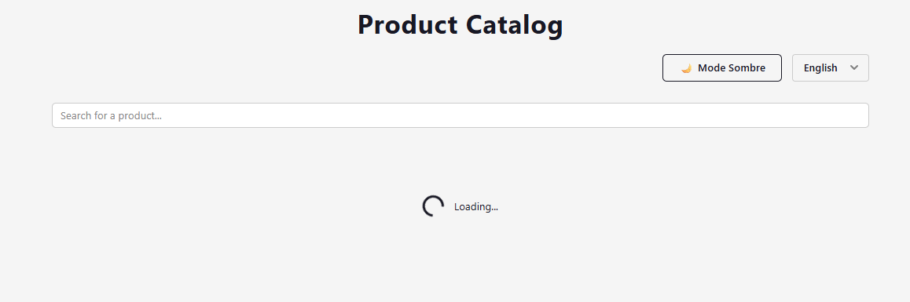
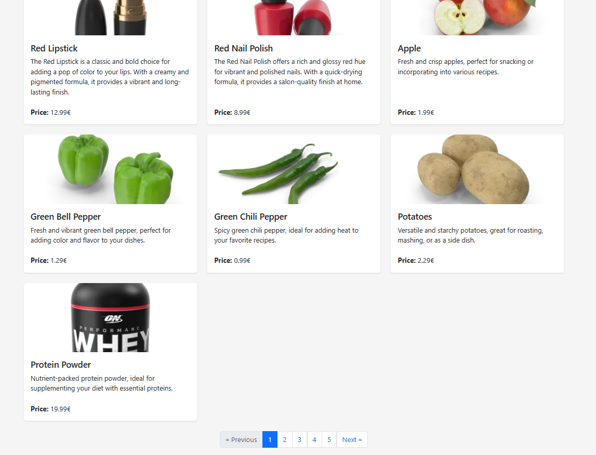
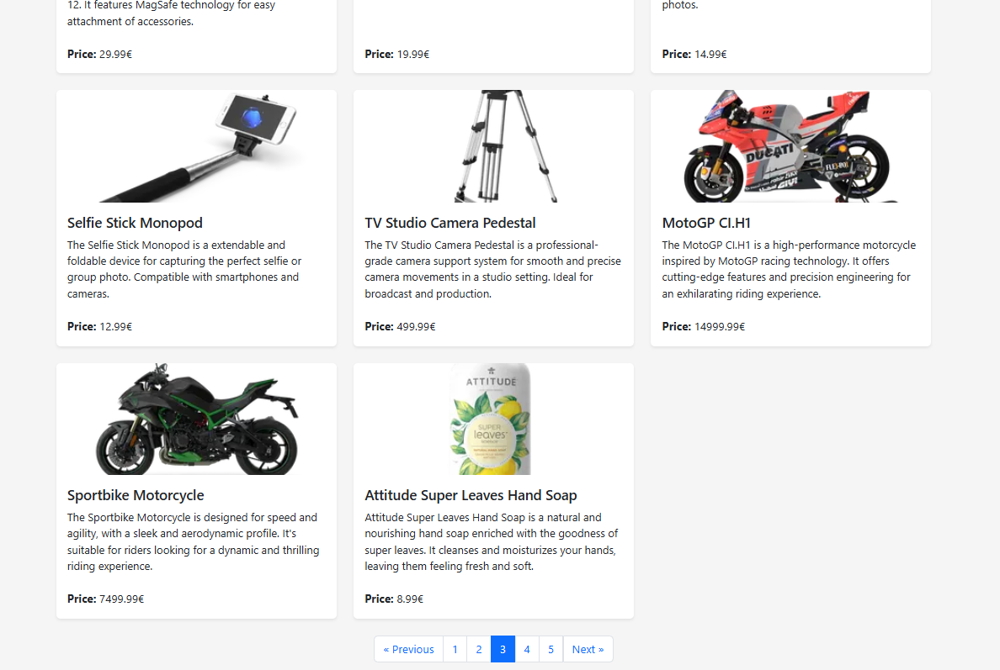
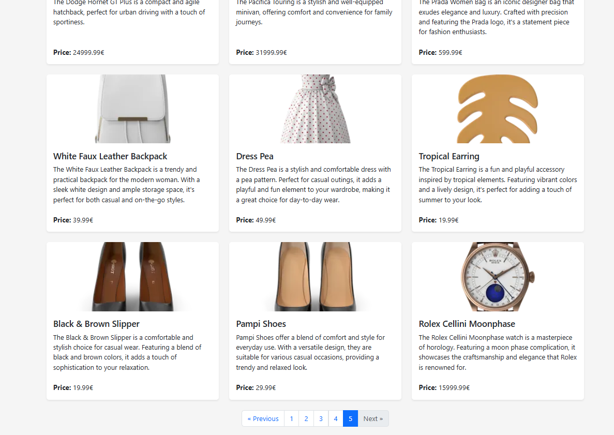

# TP React Hooks - Application de Gestion de Produits

Ce TP a pour objectif de mettre en pratique l'utilisation des Hooks React (useState, useEffect, useContext) ainsi que la création de Hooks personnalisés.

## Installation et configuration initiale

1. Cloner le dépôt :```bash
git clone https://github.com/pr-daaif/tp-react-hooks.git
cd tp-react-hooks```

2. Créer votre propre dépôt sur Github et changer le remote :
```bash
# Supprimer le remote origine
git remote remove origin

# Ajouter votre nouveau remote
git remote add origin https://github.com/youssef-baaziz/tp-react-hooks.git

# Premier push
git push -u origin main
```

3. Installer les dépendances :
```bash
npm install
```

4. Lancer l'application :
```bash
npm start
```

## Instructions pour le TP

Pour chaque exercice :
1. Lisez attentivement l'énoncé
2. Implémentez la solution
3. Testez votre implémentation (pensez à faire des copies d'écran)
4. Mettez à jour la section correspondante dans ce README avec :
   - Une brève explication de votre solution
   - Des captures d'écran montrant le fonctionnement
   - Les difficultés rencontrées et comment vous les avez résolues
5. Commitez vos changements avec un message descriptif

### Exercice 1 : État et Effets 
#### Objectif : Implémenter une recherche en temps réel

- [ ] 1.1 Modifier le composant ProductSearch pour utiliser la recherche
- [ ] 1.2 Implémenter le debounce sur la recherche
- [ ] 1.3 Documenter votre solution ici

_Votre réponse pour l'exercice 1 :_
```
🔹 Solution mise en œuvre :
1. Composant ProductSearch :
J’ai utilisé l’état searchTerm pour synchroniser la valeur du champ de recherche.
Chaque saisie met à jour l’état, déclenchant un re-rendu du composant parent.

2. Implémentation du debounce :
Pour éviter un filtrage à chaque frappe, j’ai mis en place une fonction "debounce" via useEffect.
- Un setTimeout attend 1 seconde après la saisie.
- Si l’utilisateur tape avant la fin du délai, l’ancien timer est annulé grâce à clearTimeout.
- La recherche ne se lance que si l’utilisateur s’arrête de taper pendant 1 seconde.

Problèmes rencontrés :
Initialement, la recherche s’exécutait à chaque frappe, entraînant trop d’appels API.
Solution : l’utilisation du return dans useEffect pour nettoyer avec clearTimeout.


```


### Exercice 2 : Context et Internationalisation
#### Objectif : Gérer les préférences de langue

- [ ] 2.1 Créer le LanguageContext
- [ ] 2.2 Ajouter le sélecteur de langue
- [ ] 2.3 Documenter votre solution ici

_Votre réponse pour l'exercice 2 :_
```
🔹 Solution :
1. Création du LanguageContext :
- Fichier LanguageContext.js contenant le contexte.
- Stocke la langue actuelle (language) et une fonction changeLanguage pour la mettre à jour.

2. Sélecteur de langue (LanguageSelector.js) :
- Utilisation du contexte pour accéder à language et changeLanguage.
- Modification de la langue avec setLanguage().


```
. Version anglaise  

. Version française  


### Exercice 3 : Hooks Personnalisés
#### Objectif : Créer des hooks réutilisables

- [ ] 3.1 Créer le hook useDebounce
- [ ] 3.2 Créer le hook useLocalStorage
- [ ] 3.3 Documenter votre solution ici

_Votre réponse pour l'exercice 3 :_
```
🔹 Solution :
1.Hook useDebounce : 
J'ai créé ce hook pour retarder la mise à jour d'une valeur. Cela permet d'attendre que l'utilisateur ait fini de taper avant de lancer une recherche, ce qui rend l'application plus rapide et évite les requêtes inutiles.

2.Hook useLocalStorage : 
Ce hook sert à sauvegarder automatiquement des données dans le navigateur. Il s'assure que si vous actualisez la page, vos informations (comme la langue choisie) ne sont pas perdues.
```

### Exercice 4 : Gestion Asynchrone et Pagination
#### Objectif : Gérer le chargement et la pagination

- [ ] 4.1 Ajouter le bouton de rechargement
- [ ] 4.2 Implémenter la pagination
- [ ] 4.3 Documenter votre solution ici

_Votre réponse pour l'exercice 4 :_
```
🔹 Solution :
1.Bouton de rechargement

Un bouton "Recharger" ou "Reload" relance l’appel API.
2.Pagination

Gestion des pages avec nextPage et previousPage.

```
. Bouton de rechargement  

. Chargement lors du clique en recharger  

. Pagination 


. Navigation avec "Next"  


## Conclusion

- Ce TP a permis de manipuler différents concepts clés de React : la gestion d’état avec useState, les effets secondaires avec useEffect, le partage de données globales via useContext et la création de hooks personnalisés pour améliorer la réutilisabilité du code.

- Grâce à l’implémentation de fonctionnalités telles que la recherche avec debounce, l’internationalisation, la persistance des données et la pagination, l’application couvre un large éventail de bonnes pratiques.
Ces acquis pourront servir de base solide pour développer des applications React plus complexes et maintenables à l’avenir.

